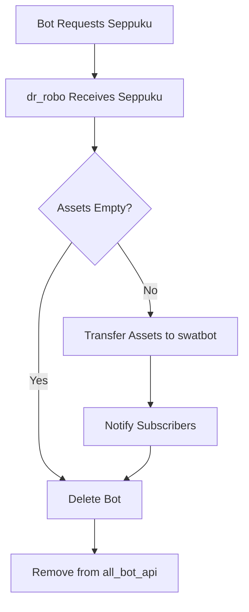

---

# **Dr. Robo: Core Bot Lifecycle & Trade Management System**

## **1. Overview & Purpose**
- **Core Responsibility**: Manages the lifecycle, state, and trades of a collection of autonomous trading bots ("bots"). lock-free single thread => low probability of encountering pathological states (all math & trades can be verified)
- **Key Features**:
  - **Actor Pattern**: Each bot runs as an independent actor, communicating via message-passing.
  - **Account Management**: Tracks cash, stocks, options, and collateral for each bot.
  - **Trade Execution**: Routes trade requests to a central trade processor (`dr_bot0`).
  - **Bot Lifecycle**: Handles creation, death, and asset dispersal (e.g., "seppuku" for self-destruction, "zombied" for cleanup).
  - **Subscription System**: Bots subscribe to tickers, account updates, and other bots for real-time data.

---

## **2. Architecture**

### **A. Core Data Structures**
#### **1. `BotaAccount`**
- Represents a bot's financial state:
  ```rust
  pub struct BotaAccount {
      pub m_cash: f64,
      pub m_stock: Option<dsta::OwnedPosition>,
      pub m_long_calls/puts: Option<dsta::OwnedPosition>,
      pub m_short_calls/puts: Option<dsta::OwnedPosition>,
      pub m_*_lein: f64, // Collateral for short positions
  }
  ```
  - **Constraints**: Only one position per asset type, all tied to the same underlying stock.

#### **2. Specialized Bots**
- **`swatbot`**: Acts as a "sink" for assets from deleted bots (e.g., `USER_DEAD_[OLD_BOT_NAME]`).
- **`USER_CASH`**: Central bot for cash pooling.

---

### **B. Modules & Workflows**
#### **1. `dr_robo.rs`**
- **Main Loop**: Listens for messages (e.g., new bots, trades, state updates) via Tokio channels.
- **Key Functions**:
  - **`process_new_robot`**: Spawns a new bot, registers it, and initializes its actor thread.
  - **`process_a_snively`**: Handles frontend commands (e.g., start/stop/kill bots).
  - **`process_pls_trade`**: Routes trade requests to `dr_bot0` and updates bot states.
  - **`process_new_brain`**: Manages bot state transitions (e.g., `Running` → `Trading` → `Seppuku`).
  - **`process_swap_info`**: Handles asset transfers between bots (e.g., cash, stocks, options).

#### **2. `from_dr_r`**
- **Bot Creation**: Validates and spawns new bots, notifies the frontend.

#### **3. `from_seek`**
- **Frontend Interface**: Processes user commands (e.g., `LiveBotName`, `KillBotName`).

#### **4. `from_bota`**
- **Bot Actions**: Handles requests from bots (e.g., trades, subscriptions, asset swaps).

---

### **C. Bot Lifecycle Management**
1. **Creation**:
   - Validates bot names, spawns actor threads, and registers in `all_bot_api`.
   - Example:
     ```rust
     from_dr_r::process_new_robot(new_bot, &mut all_bot_api, ...).await;
     ```

2. **Operation**:
   - Bots run autonomously, subscribing to tickers and account updates.
   - Trade requests are routed to `dr_bot0` for execution.

3. **Death**:
   - **Seppuku**: Bot initiates self-destruction, disperses assets.
   - **Zombied**: Bot is force-cleaned; remaining assets go to `swatbot` or `USER_CASH`.
   - Example:
     ```rust
     if mind_state == BotMindState::Zombied {
         // Disperse assets to sink bots
     }
     ```

---

### **D. Trade & Asset Management**
- **Trade Flow**:
  1. Bot sends dry-run trade request → `dr_robo` → `dr_bot0`. - reduces 
  2. Bot gets transaction fee costs from dry run, 
  3. Bot swaps with USER_CASH swatbot - trade fails if swap fails

  1. Bot sends REAL trade request → `dr_robo` → `dr_bot0`.
  2. `dr_bot0` executes trade, updates accounts.
  3. `dr_robo` applies changes to bot states.
- **Asset Swaps**:
  - Supports cash/stock/option transfers between bots.
  - Validates collateral and cash balances before swaps.
  - Example:
    ```rust
    process_swap_info(bot_index, botswap, &mut all_bot_api, ...).await;
    ```


  it should get a swap_ok after it requests the swap from cash; then place trade. 
  disallow the trade when it fails swap.


---

### **E. Subscription System**
- **Tickers**: Bots subscribe to stock/option tickers for real-time data.
- **Account Updates**: Bots subscribe to each other’s state changes.
- Example:
  ```rust
  process_pls_ticks(bot_index, ticker, &all_bot_api, ...).await;
  ```

---

## **3. Key Strategies**
### **A. Error Handling**
- **Graceful Degradation**: Logs errors (e.g., channel failures) but continues operation.
- **Validation**: Checks for negative cash, duplicate bot names, and invalid states.

### **B. Concurrency**
- **Tokio Runtime**: Uses async/await for non-blocking I/O.
- **Message Passing**: Channels (`mpsc`) for inter-bot communication.

### **C. Asset Dispersal**
- **Sink Bots**: `USER_DEAD_*` and `USER_CASH` absorb assets from deleted bots.
- **Magic Index 0**: Special handling for system-level bots (e.g., `dr_bot0`).

### **D. Logging**
- **Debug/Info/Warn/Error**: Extensive logging for traceability.

---

## **4. Example Workflow**
1. **User creates a bot**:
   - Frontend sends `MakeBotBuzz` → `dr_robo` validates and spawns the bot.
2. **Bot requests a trade**:
   - Bot sends `pls_trade` → `dr_robo` routes to `dr_bot0`.
3. **Bot dies**:
   - Bot reports `Seppuku` → `dr_robo` disperses assets to `swatbot`.

---

## **5. Key Files & Components**
| Component          | Role                                  |
|--------------------|---------------------------------------|
| `dr_robo.rs`       | Core lifecycle/trade management       |
| `dr_bot0.rs`       | Trade execution engine                |
| `dr_seek.rs`       | Frontend communication                |
| `BotaAccount`      | Bot financial state                   |
| `BotSwaper`        | Asset transfer struct                 |

---

## **6. Observations**
- **Strengths**:
  - Modular, actor-based design for scalability.
  - Robust error handling and logging.
  - Clear separation of concerns (e.g., trade execution vs. lifecycle management).
- **Potential Improvements**:
  - **Testing**: Unit/integration tests for edge cases (e.g., concurrent swaps).
  - **Documentation**: Add Rustdoc for public APIs.
  - **Performance**: Optimize `HashMap` lookups for large bot counts.

---

------
PART 2:
------

Here’s the **complete logic flow tree**, now including the **startup sequence** at the top, followed by the rest of the lock-free state machine workflows.

---

# **Dr. Robo: Startup & Lock-Free State Machine Logic Flow**

---

## **1. Startup Sequence**
```
└─── f_run_main_dr_robo()
    ├─── Initialize Channels
    │   ├─── tell_dr_a_snively (Frontend Commands)
    │   ├─── tell_dr_new_robot (New Bot Creation)
    │   ├─── tell_dr_new_brain (Bot State Updates)
    │   ├─── tell_dr_pls_trade (Trade Requests)
    │   ├─── tell_dr_swap_info (Asset Transfers)
    │   ├─── tell_dr_pls_ticks (Ticker Subscriptions)
    │   └─── ... (Other Channels)
    │
    ├─── Initialize Data Structures
    │   ├─── all_bot_api: Vec<Option<BotApi>> (Bot Registry)
    │   ├─── map_bots_index: HashMap<String, usize> (Bot Name → Index)
    │   ├─── all_bot_checks: Vec<Vec<usize>> (Subscription Lists)
    │   ├─── map_tick_looks: HashMap<String, Vec<usize>> (Ticker → Bot Subscribers)
    │   └─── asset_infos: HashMap<String, dsta::FinAss> (Asset Metadata)
    │
    ├─── Spawn Core Bots
    │   ├─── Bot 0 (Trade Execution Engine)
    │   │   ├─── Spawn dr_bot0 Task
    │   │   └─── Initialize Channels for TTAI & Trade Processing
    │   │
    │   ├─── Bot 1 (Frontend Interface: dr_seek)
    │   │   └─── Spawn dr_seek Task
    │   │
    │   └─── Bot 2 (Tax/Commission Bot)
    │
    ├─── Wait for Startup Confirmations
    │   ├─── Loop: Listen for Snively Messages
    │   │   ├─── Bot 0: MAGIC_BOT0_STARTUP_OK
    │   │   ├─── Bot 0: MAGIC_DTTAI_STARTUP_OK (TTAI Ready)
    │   │   └─── Bot 1: MAGIC_DSSEEK_STARTUP_OK (Frontend Ready)
    │   │
    │   └─── Timeout: DEFAULT_STARTUP_TIMEOUT_SECS
    │
    └─── Enter Main Event Loop (if all startups OK)
```

---

## **2. Main Event Loop (Lock-Free State Machine)**
### **Root: `f_run_main_dr_robo()` (Main Loop)**
```
└─── tokio::select! (Message-Driven)
    ├───┬─ told_dr_a_snively (Frontend/Internal Commands)
    │   ├─── LiveBotName → process_a_snively → Start Bot
    │   ├─── KillBotName → process_a_snively → Send Seppuku
    │   ├─── StopBotName → process_a_snively → Pause Bot
    │   └─── MakeBotBuzz/MakeStealth → Create Specialized Bot
    │
    ├─── told_dr_new_robot (New Bot Creation)
    │   └─── process_new_robot → Spawn Bot Actor → Register Bot
    │
    ├─── told_dr_new_brain (Bot State Updates)
    │   └─── process_new_brain → Handle State Transition
    │       ├─── Seppuku/Zombied → Check Assets → Disperse Assets → Delete Bot
    │       └─── Running/Trading → Update State → Notify Subscribers
    │
    ├─── told_dr_pls_trade (Trade Requests)
    │   └─── process_pls_trade → Route to dr_bot0 → Update Bot State
    │       ├─── Bot 0 → Apply Done Trade → Update Account
    │       └─── Non-Bot 0 → Cancel Existing Order → Submit New Order
    │
    ├─── told_dr_swap_info (Asset Transfers)
    │   └─── process_swap_info → Validate → Transfer Assets → Update Both Bots
    │       ├─── Cash-Only Swap → Fast Path → Update Cash
    │       └─── Full Swap → Apply Orders → Update Accounts
    │
    ├─── told_dr_pls_ticks (Ticker Subscriptions)
    │   └─── process_pls_ticks → Subscribe Bot to Ticker → Update Asset Info
    │
    ├─── told_dr_stop_tick (Unsubscribe from Ticker)
    │   └─── process_a_stop_tick → Remove Bot from Ticker Subscribers
    │
    └─── told_dr_pls_check (Subscribe to Bot Updates)
        └─── process_a_pls_check → Add Bot to Subscriber List
```

---

## **3. Detailed Subtrees**
### **(A) Bot Lifecycle: Creation → Operation → Death**
```
└─── Bot Creation (process_new_robot)
    ├─── Validate Name → No Duplicates
    ├─── Spawn Actor Thread → Register in all_bot_api
    ├─── Notify Frontend → Bot Ready
    └─── Bot Starts in "Running" State

    └─── Bot Operation
        ├─── Receive Trade Request → process_pls_trade → Route to dr_bot0
        ├─── Receive State Update → process_new_brain → Transition State
        │   ├─── Running → Trading (On New Order)
        │   ├─── Trading → Running (Order Complete)
        │   ├─── Seppuku → Disperse Assets → Delete Bot
        │   └─── Zombied → Force Disperse Assets → Delete Bot
        └─── Receive Subscription → process_pls_ticks/process_a_pls_check → Update Data Flow

    └─── Bot Death (Seppuku/Zombied)
        ├─── Check Assets → Empty or Non-Empty
        │   ├─── Empty → Delete Bot
        │   └─── Non-Empty → Transfer to swatbot/USER_CASH
        ├─── Notify Subscribers → Bot Deleted
        └─── Remove from all_bot_api/map_bots_index
```

---

### **(B) Trade Execution Flow**
```
└─── Trade Request (process_pls_trade)
    ├─── From Bot 0 → Apply Done Trade → Update Account
    │   ├─── Update Cash/Collateral → apply_account_cash_and_collateral_changes
    │   └─── Update Bot State → Running/Trading
    │
    └─── From Non-Bot 0 → Route to dr_bot0
        ├─── Cancel Existing Order (If Trading)
        ├─── Submit New Order → Update Bot State to Trading
        └─── Notify Bot → Order Commenced
```

---

### **(C) Asset Swap Flow**
```
└─── Swap Request (process_swap_info)
    ├─── Validate Involved Bots → Not in Trading State
    ├─── Cash-Only Swap → Fast Path
    │   ├─── Calculate Net Cash Change → Source/Target
    │   ├─── Validate Non-Negative Cash → Proceed/Reject
    │   └─── Update Cash → Notify Bots
    │
    └─── Full Swap (Cash + Positions)
        ├─── Create Fake Orders → Simulate Transfer
        ├─── Apply Orders to Source/Target → Update Accounts
        ├─── Transfer Cash → Update Balances
        └─── Notify Bots → Swap Complete
```

---

### **(D) Ticker Subscription Flow**
```
└─── Ticker Subscription (process_pls_ticks)
    ├─── Add Bot to map_tick_looks → Ticker → [Bot Indices]
    ├─── Request Ticker Data from TTAI → Wait for Response
    ├─── Update asset_infos → Insert New Ticker/Options
    └─── Notify Bot → Subscription Active
```

---

### **(E) Bot State Transition Rules**
| **Current State** | **Event**               | **Next State**       | **Action**                                  |
|-------------------|-------------------------|----------------------|---------------------------------------------|
| Running           | New Order               | Trading              | Submit Order to dr_bot0                     |
| Trading           | Order Complete         | Running              | Update Account, Notify Subscribers          |
| Trading           | Seppuku Request         | Seppuku              | Cancel Orders, Disperse Assets              |
| Running           | Zombied Report          | Zombied              | Force Disperse Assets, Delete Bot          |
| Seppuku/Zombied   | Assets Empty            | (Deleted)            | Remove from all_bot_api                    |

---

## **4. Key Features of the Lock-Free Design**
1. **Message-Passing Architecture**:
   - All state transitions are triggered by messages (e.g., `told_dr_new_brain`, `told_dr_pls_trade`).
   - No locks: Each bot/actor owns its state, and updates are atomic per message.

2. **Actor Isolation**:
   - Bots run in separate Tokio tasks.
   - Shared state (e.g., `all_bot_api`) is only modified in response to messages.

3. **Idempotent Operations**:
   - Swaps/trades are validated before execution (e.g., cash balances, bot states).
   - Retries or rollbacks are handled.

4. **Event Sourcing**:
   - State changes are logged.

5. **Resource Efficient**: 
   - No cpu usage aside from message processing.
---

## **5. Example: Bot Death Workflow**

---


// TO add for swat/sally/stealth:

# Swat Bot Help

Swat Bot is a **“dummy workhorse”** bot that discovers, holds, and exits positions on your behalf. It is used both as a discovery tool (to pull assets into the system) and as a sink for assets from other bots when they die.

***

## 1. What Swat Bot Does

- Discovers assets  
  - When you search/select a stock or option in the UI, a Swat Bot is created to track it.  
  - Assets found by a Swat Bot become available as choices when you configure other bots (Stealth, Sally, etc.).  
- Holds and reports positions  
  - Swat Bot keeps track of cash, stock, and options in a simple account.  
  - It subscribes to tickers so the frontend can show live prices for assets it holds or tracks.  
- Receives assets from dead bots  
  - When any other bot dies (Stealth, Sally, or others), their remaining assets are moved into a Swat Bot for cleanup.  
- Aggressive exit on command  
  - When Swat Bot is told to Seppuku (self-destruct), it builds and manages aggressive exit orders to flatten all positions as fast as practical.  
  - Once all assets are gone, Swat Bot marks itself as “dead” (Zombied) and releases those resources.

Swat is not meant for long-term strategy; it is the **utility bot** that does the dirty work of exiting positions and serving as an asset warehouse.

***

## 2. When to Use Swat Bot

Use Swat Bot when you:

- Browse or search assets  
  - Selecting a symbol in the UI implicitly creates a Swat Bot so the system can request detailed data and tickers.  
- Need a safe place for orphaned positions  
  - If a strategy bot dies while holding assets, they are sent to a Swat Bot so nothing is lost.  
- Want to clean up positions quickly  
  - Trigger Seppuku on a Swat Bot holding positions to aggressively exit everything under its control.

You do **not** typically configure Swat Bot manually. It is created for you behind the scenes as part of search, asset selection, and bot cleanup.

***

## 3. Swat Bot Entry Arguments

If/when Swat Bot is visible as a configurable bot type, these are the typical fields you will see.

### 3.1 Core Identity

- **Friendly Name**  
  Human-readable name for this Swat Bot.  
  - Convention: usually `USER_[TICKER]` for user-level bots (e.g., `USER_SPY`), or `DEAD_[OLD_BOT_NAME]` for inheritance from a dead bot.  
  - Used to identify the bot in logs and in the UI.

- **Tracking Ticker**  
  The main symbol Swat Bot will follow (stock or option).  
  - This ticker is always subscribed so the bot can maintain up-to-date quotes.  
  - Additional tickers may be added automatically for actual positions (e.g., options it holds).

### 3.2 Risk & Haggle Settings

Swat Bot inherits some “generic bot” parameters, even though its strategy is fixed:

- **Haggle Method**  
  Defines how Swat Bot adjusts order prices over time to get filled.  
  - Swat is configured as **aggressive**: it starts close to the market and quickly concedes to improve fill odds when exiting.  
- **Haggle Action / Retry Period**  
  Controls how often Swat applies a haggle step and how much price slippage it tolerates before giving up.  
  - Swat uses shorter retry intervals and higher maximum slippage because its goal is to exit, not to get the “perfect” price.  
- **Max Cash Risk**  
  Typically not relevant for Swat (it doesn’t open new risk; it exits existing positions), but it may still appear as part of the shared settings template.

### 3.3 Startup Arguments (Advanced)

Most users will not touch these, but for completeness:

- **Initial Swap Info**  
  Internal parameter indicating whether Swat should perform an initial asset or cash swap when created.  
  - Example: creating a Swat Bot preloaded with a position migrated from another bot.  
- **Save/Resume State**  
  Swat Bot automatically loads previous state (if any) when restarted and saves state when it is stopped. This is surfaced as “resume from previous run” and usually requires no user interaction.

***

## 4. Behavior Details

### 4.1 Tracking & Discovery

- At creation, Swat Bot requests metadata for its tracking ticker (stock or option).  
- It inserts a zero-quantity position for that asset into its account so that it can store the most recent ticker data.  
- It then subscribes to:  
  - The tracking ticker.  
  - Any tickers for actual positions it holds (stocks or options).  
- These tickers are periodically forwarded to the frontend, allowing the UI to show prices and let you choose those assets when configuring new bots.

### 4.2 Asset Inheritance from Other Bots

When another bot dies:

- Remaining positions (stock and options) are transferred into a Swat Bot assigned to that user or strategy.  
- The Swat Bot now “owns” those positions and will show them in its account.  
- The Swat Bot will continue to receive ticker updates for all inherited assets.

This design guarantees that no asset disappears when a strategy bot shuts down; everything ends up somewhere visible and manageable.

### 4.3 Seppuku (Self-Destruct)

When Swat Bot receives a Seppuku command:

1. It inspects its account to find the position (or positions) it needs to exit.  
2. It constructs an **aggressive** exit order:  
   - If it is long, it sells to close, starting just inside the bid and quickly improving.  
   - If it is short, it buys to close, starting just inside the ask and quickly improving.  
3. It uses a haggle process to re-submit the order at better prices if fills do not complete within a short interval.  
4. It tracks:  
   - How much of the original position has been filled.  
   - How much slippage (price concession) has been used.  
   - How long the order has been working.  
5. It stops when either:  
   - The position is effectively flat.  
   - A safety timeout or slippage limit is hit (in which case it cancels outstanding orders).  
6. Once positions are flat, Swat Bot marks itself as **Zombied** and is cleaned up by the system.

***

## 5. Limitations & Best Practices

- Swat Bot is not a strategy bot; it does not try to optimize P&L.  
- Use Swat Bot implicitly via the UI (search/select assets) and let it handle cleanup and discovery.  
- For structured trade logic (credit spreads, conditional entries), use Sally or Stealth and let Swat handle leftovers.

***

# Sally Bot Help

Sally Bot is a **virtual broker layer** that lets you design orders that only hit the real broker when your conditions are met. It acts like a programmable “wrapper” around limit and stop orders, but **keeps them off the broker’s order book** until you decide they are ready.

***

## 1. What Sally Bot Does

- Hides your orders from the broker  
  - You define a multi-leg order (stock and/or options) and your trigger conditions.  
  - Until the conditions are satisfied, nothing is sent to the broker.  
- Executes when your conditions are met  
  - Once the trigger fires, Sally constructs and sends the real order, then manages the haggle and confirmation until the fill is done.  
- One-and-done behavior  
  - Sally is designed for **single-use orders**: once your configured order is filled and processed, the bot shuts itself down.

Typical use cases:

- “Only buy this spread if its mid price reaches X, but don’t place a limit order on the exchange yet.”  
- “Submit this order when the market-side price crosses my trigger level.”  
- Test-mode: “Send the order immediately, but via the Sally layer for logging and automation.”

***

## 2. Required Inputs (Entry Arguments)

When you create a Sally Bot, you configure:

### 2.1 Common Info

- **Friendly Name**  
  A unique name for this Sally Bot.  
  - Helps you find it in the UI and logs (e.g., `sally_spy_put_spread_test`).  

- **Tracking Ticker**  
  A main symbol associated with this bot (often the underlying stock, e.g., `SPY`).  
  - Used for general monitoring and logging.  
  - Actual orders can still reference multiple tickers (stock or options).

- **Haggle Profile**  
  Determines how Sally adjusts prices when trying to get filled:  
  - Sally is **cheap**: she tries to get good prices and is less aggressive than Swat or Stealth.  
  - Typical behavior: smaller price concessions, longer time between retries, tighter limit on total slippage.

### 2.2 Hidden Order Definition

This is the actual order you want executed **once** the conditions are met.

- **Order Legs**  
  Each leg has:  
  - Asset (stock or option).  
  - Action:  
    - Buy to Open, Sell to Open, Buy to Close, Sell to Close.  
  - Quantity (in contracts or shares).  
  - Limit price per unit.  

Example (bull put spread credit):

- Leg 1: Sell to Open 1 × PUT 450 at a limit of 3.00  
- Leg 2: Buy to Open 1 × PUT 445 at a limit of 1.50

Sally treats the group as one “hidden combo” order.

### 2.3 Trigger Behavior (`SallyAction`)

Defines **when** the hidden order should be sent to the broker.

Supported styles:

- **SubmitRightAwayButLikeOnlyUseForTest**  
  - Immediately sends the hidden order (no market-based trigger).  
  - Use for debugging or when you still want Sally’s haggle and logging layer.

- **SubmitWhenBidAskMidAttainsInputPrice(target_price)**  
  - Compute the **combo mid price** from current quotes on all legs.  
  - For a net credit order: trigger when the mid price is **at or above** `target_price`.  
  - For a net debit order: trigger when the mid price is **at or below** `target_price`.  
  - This is the most common “virtual limit” behavior.

- **SubmitWhenMarketSideReachesThisPrice(target_price)**  
  - Looks at the “market side” price:  
    - For net credit: uses the best bid of the combo.  
    - For net debit: uses the best ask of the combo.  
  - Triggers when that market side price is at or beyond your target.  
  - Useful if you care about fill feasibility rather than mid price.

- **SubmitAtThisTimeUnlessItReachesPrice(time, price)**  
  - Concept: “If price gets here, trigger early; otherwise, send at this time.”  
  - Time-based behavior may be partially implemented or flagged as experimental.

***

## 3. Lifecycle

### 3.1 Creation & Funding

1. **Create Sally Bot** with your arguments.  
2. The system loads any existing saved state; if none, it creates a fresh Sally brain in `WaitingForTrigger`.  
3. Sally computes how much cash or collateral the hidden order will require.  
4. If needed, she requests a cash swap from a central cash pool (e.g., `USER_CASH`).  
   - If allocation succeeds, she proceeds.  
   - If it fails or times out, she stops and marks herself as dead.

### 3.2 Ticker Setup

Before evaluating triggers:

- Sally requests ticker details for **every asset** in the hidden order.  
- She subscribes to ticker updates so she always has fresh bid/ask/last for each leg.

### 3.3 WaitingForTrigger

In this state Sally:

- Ensures each leg has a current quote.  
- Computes combo bid, ask, and mid based on leg prices and direction (buy vs sell).  
- Evaluates the configured `SallyAction`.  
- If the trigger is **not** met, she simply waits for more quotes.  
- If the trigger **is** met:  
  - Sally constructs an initial order with her cheap haggle settings.  
  - Sends the order to the broker.  
  - Waits for a confirmation that the order is accepted/routed.  
  - Moves to `OrderActive`.

### 3.4 OrderActive (Haggle & Fill)

In `OrderActive`, Sally:

- Monitors fills by comparing actual positions against intended quantities.  
- If the order is fully filled (or close enough):  
  - She marks her state as `Filled`.  
- If the order is not filled:  
  - At periodic intervals, she applies another haggle step:  
    - Slightly adjusts the limit price toward a more favorable fill.  
    - Respects a maximum total slippage so she doesn’t overpay or undersell.  
  - Resubmits the adjusted order until:  
    - Fill completes, or  
    - Timeouts/slippage bounds are hit (in which case she will log an error and stop).

### 3.5 Completion

Once the order is fully filled and processed:

- Sally logs the completion.  
- Marks herself as **Zombied**.  
- Dr. Robo cleans up the bot.  
- Any resulting positions remain in your account, where they can be managed by Swat or other bots.

***

## 4. Best Practices

- Use Sally for **virtualized orders** that should not appear on the broker’s book until conditions are right.  
- Prefer mid-based triggers for spread limit logic, and market-side triggers when you care more about execution probability.  
- Keep sizes modest when first testing; Sally’s behavior is deterministic but still subject to market conditions.  
- Combine Sally with Swat:  
  - Sally opens structured positions.  
  - Swat can later clean them up on demand.

***

# Stealth Bot Help

Stealth Bot is a strategy bot that enters a **specified risky long option** and then manages it automatically. It watches for both profit and loss, and, when conditions allow, converts the position into a spread to **lock in gains**.

***

## 1. What Stealth Bot Does

- Opens a long options position  
  - Buys a call or put a chosen distance from ATM, for a chosen expiry.  
- Monitors that position  
  - Watches price movements, profit/loss, and time.  
- Automatically exits on loss  
  - If price falls below your configured loss threshold, Stealth exits the long position.  
- Locks in profits via a spread  
  - If profits reach your target, Stealth sells a second option to form a spread, “locking in” some of the gain and capping risk.  
- Manages spread exit  
  - After the spread is created, Stealth tracks either profit percentage, short-leg moneyness, or time-to-expiry to decide when to close both legs.

Stealth aims to be a **semi-automated swing/position** options strategy with built-in risk and reward rules.

***

## 2. Entry Arguments (MakeStealthBot)

When creating a Stealth Bot, you must specify:

### 2.1 Common Info

- **Friendly Name**  
  Unique identifier for the bot (e.g., `stealth_spy_put_locker`).  

- **Tracking Ticker**  
  The underlying stock or ETF symbol the bot trades (e.g., `SPY`).  
  - All options Stealth selects are based on this underlying.  

- **Haggle Settings**  
  Stealth uses a **mid-level** haggle style (between Swat’s aggressive and Sally’s cheap) for all its orders.  
  - You normally don’t adjust this directly; it is part of shared configuration.

### 2.2 Capital & Risk

- **My Cash Allocation (`my_cash_alloc`)**  
  The amount of cash Stealth should request from your cash pool to run this strategy.  
  - Example: `5000.00` means Stealth will request about $5,000 of buying power.  
  - Used to determine how many contracts it can buy.

- **Max Cash Risk (in CommonBotInfo)**  
  Another layer of risk control, often expressed as percentage and absolute dollar maximum.  
  - Stealth uses the minimum or maximum of these values (depending on settings) to cap position size.

### 2.3 Direction & Option Selection

- **Market Direction (`stonk_feeling`)**  
  - `GetStonk` (bullish): Stealth buys calls and then may create a call spread.  
  - `Corrects` (bearish): Stealth buys puts and then may create a put spread.

- **Option Expire (`option_expire`)**  
  - Minimum number of calendar days until expiration.  
  - Stealth chooses an expiry at or beyond this, from available options.  
  - Example: `30` → choose options expiring at least 30 days out.

- **Option Bucket (`option_bucket`)**  
  - How far from ATM to place the **entry** (long) option.  
  - 0 = at-the-money.  
  - 1 = one strike OTM (or ATM+1 step), 2 = two strikes away, etc.  
  - For puts in a bearish strategy, Stealth picks a strike below ATM; for calls in a bullish strategy, a strike above ATM.

- **Spread Bucket (`spread_bucket`)**  
  - How far back toward ATM Stealth goes to select the **short** option when forming the spread.  
  - Typically 1–2; higher values produce wider spreads.  
  - For puts: short strike is closer to ATM (higher strike).  
  - For calls: short strike is closer to ATM (lower strike).

### 2.4 Profit & Loss Targets

- **Exit Gain Percentage (`exit_gain_pct`)**  
  - Profit threshold on the long leg before triggering spread entry.  
  - Example: `50.0` means “re-evaluate for spread when the long option is up about 50% from entry.”  
  - Internally used to compute the required short-leg price at which selling the short leg “locks in” this gain.

- **Exit Loss Percentage (`exit_loss_pct`)**  
  - Maximum allowed loss on the long leg, expressed as a negative percentage.  
  - Example: `-80.0` means “cut the long position if it loses 80% of its value” (floor at 20% of entry price).

Stealth computes a **floor price** for the long leg:  
- `floor_price = entry_price × (1 + exit_loss_pct/100)`.

### 2.5 Spread Exit Strategy (`nice_exit_way`)

A list of exit rules; **any one** of them can trigger final exit after the spread is formed. Examples:

- **OtmShort**  
  - Exit when the short leg is out-of-the-money (favorable direction).  
  - Example: for bearish put spread, if underlying rises above the short strike, short leg becomes OTM → exit.

- **FinalPct(pct)**  
  - Exit when the spread has achieved `pct%` of its maximum possible profit.  
  - Example: `FinalPct(75.0)` → close spread at 75% of max profit.

- **PriorDay(time, pct, days)` / `FinalDay`**  
  - Time-based exits near expiration; close the spread at or before a specific day/time, possibly with profit conditions.

- **GoExpire**  
  - Hold until expiration, allowing the options to expire rather than closing early.  
  - Advanced users only; it can expose you to assignment/exercise behavior.

***

## 3. Lifecycle & Behavior

### 3.1 Startup

1. Stealth requests details about the underlying asset and available options.  
2. It loads any existing saved state; if none, it starts fresh.  
3. It requests the configured cash allocation from your cash pool.  
4. It waits for ticker data on the underlying to determine the ATM strike and select the appropriate option chain (calls or puts).  
5. It picks:  
   - Long leg: ATM + `option_bucket` strikes in the chosen direction.  
   - Short leg (for future spread): relative to the long strike using `spread_bucket`.  
6. It subscribes to tickers for:  
   - Underlying.  
   - Long option.  
   - Short option.

### 3.2 Entry Phase (Long Leg)

- Stealth calculates how many contracts it can afford given `my_cash_alloc` and risk constraints.  
- It submits a **Buy to Open** order for the long option at a price derived from either the theoretical value or the bid/ask midpoint.  
- Once the order is accepted, Stealth waits for a fill:  
  - Full fill: proceed.  
  - Partial fill: adjust size and continue, or abort if insufficient after timeouts.

When entry is filled, Stealth:

- Records the average entry price.  
- Derives the **loss floor** from `exit_loss_pct`.  
- Moves to the monitoring state.

### 3.3 Monitoring (Long-Only)

While holding only the long leg, Stealth:

- Continuously checks the option price vs:  
  - Loss floor (for stop loss).  
  - Profit threshold (for spread entry).  
- If price ≤ floor → initiate **loss exit**:  
  - Submit a **Sell to Close** order for the long leg.  
  - After confirmation and fill, end the bot.  
- If price indicates a sufficient gain → evaluate spread formation:  
  - Fetch short-leg quotes.  
  - Compute whether selling the short leg now will lock in approximately `exit_gain_pct` or more.  
  - If yes, submit a **Sell to Open** for the short leg and transition to spread management.

### 3.4 Spread Phase

Once both legs are filled and the spread is live, Stealth:

- Tracks combined P&L and max profit.  
- Evaluates the configured `nice_exit_way` rules:  
  - If any rule triggers (e.g., `OtmShort`, `FinalPct`), Stealth builds a **two-leg exit**:  
    - Sell to Close the long leg.  
    - Buy to Close the short leg.  
- Uses moderate haggle logic to improve prices while still prioritizing execution.  
- Handles partial closes (e.g., one leg fills faster) and continues working until both legs are effectively flat, or timeouts/slippage caps are hit.

### 3.5 Completion

Once the spread is fully closed:

- Stealth logs the final P&L.  
- If configured, it may return idle cash to your central pool.  
- It marks itself as Zombied and is cleaned up by the system.

***

## 4. Best Practices

- Choose `option_expire` around 30–60 days to balance time decay and responsiveness.  
- Use reasonable `option_bucket` and `spread_bucket` (e.g., 1–3 for each) to avoid extremely far OTM/ITM strikes.  
- Start with moderate `exit_gain_pct` (e.g., 30–70%) and `exit_loss_pct` (e.g., -50% to -80%) until you are comfortable.  
- Use a combination of `OtmShort` and `FinalPct` in `nice_exit_way` to get both price-based and profit-based protection.  
- Start with smaller `my_cash_alloc` (1–2 contracts) to observe behavior before scaling.

***

These three bots work together:

- **Swat Bot** – discovers assets and cleans up positions.  
- **Sally Bot** – virtualizes order submission and timing.  
- **Stealth Bot** – runs an automated, long-option-into-spread strategy with controlled risk and profit locking.